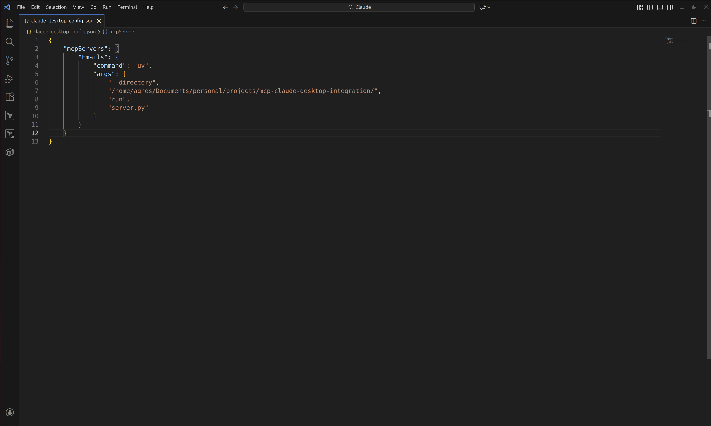
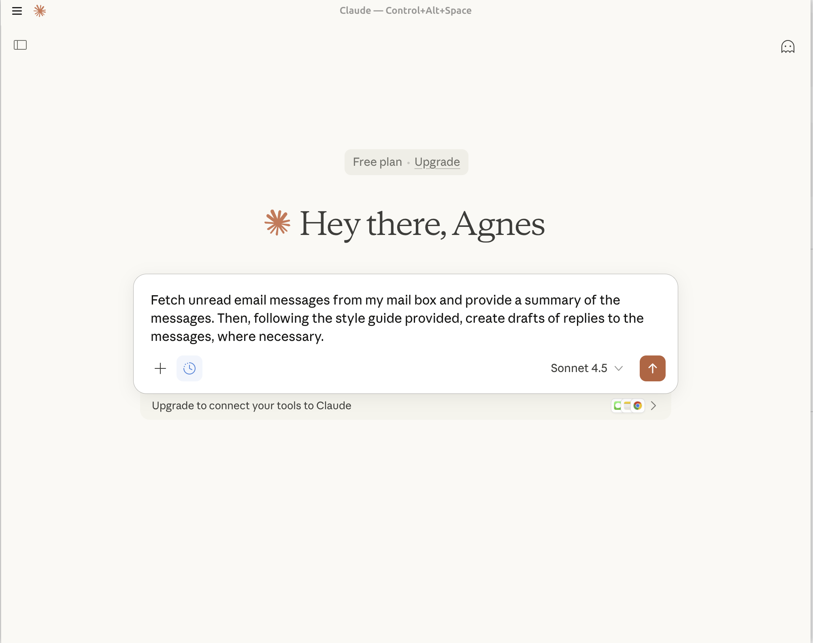
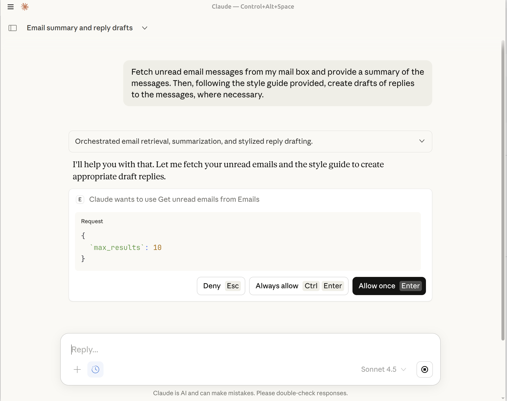

# mcp-claude-desktop-integration
A project to demonstrate the integration of MCP server with Claude Desktop 

The steps taken in the implementation of the project are as stated below:

## Implementation Steps
* The MCP server was created using Python MCP SDK and with a modular approach

* The server contains 3 tools:
1. get_unread_emails

2. fetch_email_style_guide

3. create_draft_reply

* All helper functions, utilities and services are in their appropriate directories within `src`

* THe main server file containing the tools is in the root directory

* All libraries were installed using `uv`, and the include:
1. google-api-python-client

2. google-auth

3. google-auth-oauthlib

4. mcp[cli]

5. python-dotenv

* On the `Google Console`, a new OAUTH Client was created with the following accesses:
1. gmail.readonly

2. gmail.compose

3. documents.readonly

* The generated credentials were downloaded and saved in the file `credentials.json`, stored with `src/auth`

* A special helper function in the file `auth_once.py` was created to enable interactive authentication and token generation before using the server.
The token is also stored within `src/auth`. 

* Claude desktop was installed and the file `claude_desktop_config.json` was configured with the below:

```bash
{
    "mcpServers": {
        "Emails": {
            "command": "uv",
            "args": [
                "--directory",
                "/home/agnes/Documents/personal/projects/mcp-claude-desktop-integration/",
                "run",
                "server.py"
            ]
        }
    }
}
```
This enabled the integration of the MCP server with claude-desktop to extend its functionality


### claude_desktop_config.json




## Run Workflow
* First authenticate to Google account to enable generation of a token:

```bash
cd src/auth

uv run python auth_once.py
```

* Then start claude-desktop, navigate to your Account >> Settings >> Developer >> Edit >> claude_desktop_config.json, and add the configuration above

* Navigate to chats, and add a prompt. This is a sample prompt I used in my case:

`Fetch unread email messages from my mail box and provide a summary of the messages. Then, following the style guide provided, create drafts of replies to the messages, where necessary.`


### Prompt



* Below screenshots show the output generated by claude-desktop...


